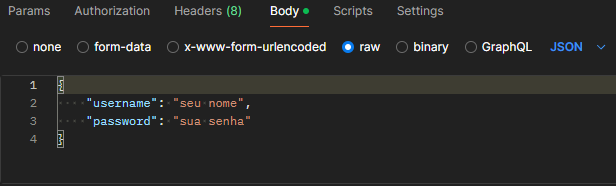
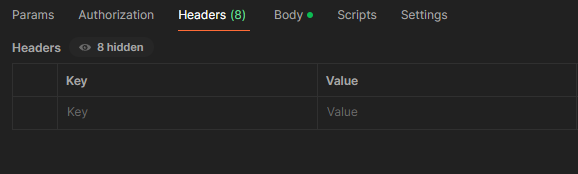
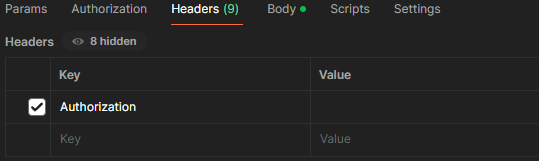
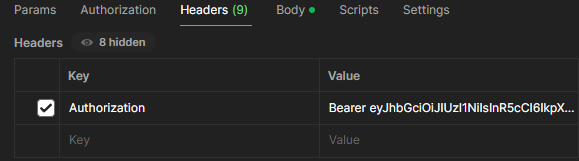
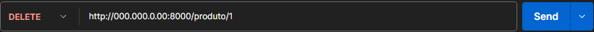

# Introdução
Este projeto consiste em uma API RESTful que funciona como CRUD de um banco de dados de um supermercado.

## Tecnologias usadas
- **[Flask](https://flask.palletsprojects.com/)**
- **[Flask-JWT-Extended](https://flask-jwt-extended.readthedocs.io/en/stable/)**
- **[Datetime](https://docs.python.org/3/library/datetime.html)**
- **[Postman](https://www.postman.com/)**
    

## Como cadastrar o usuário:
Tenha em mente que todos os endpoints da API precisam de um token de acesso, somente o usuário cadastrado pode acessar os endpoints.

Primeiro de tudo, você precisa acessar o arquivo `routes.py` e ir até a linha 8 onde tem o seguinte código: 
```python
app.config['JWT_SECRET_KEY'] = 'sua_chave_secreta' 
```
bem onde há `'sua_chave_secreta'` você escreverá sua própria chave, lembre-se que ela tem que ser uma string com letras embaralhadas!


Após isso, precisamos cadastrar o usuário, para isso vamos abrir o Postman e acessar o endpoint `/register` utilizando o método **POST** e digitar o seguinte padrão:

```json
{
    "username": "seu nome",
    "password": "sua senha"
}
```
`username` e `password` são as palavras chave para a aplicação funcionar.


Em seguida vamos acessar o endpoint `/login` também utilizando o método POST, seguindo o mesmo padrão anterior
```json
{
    "username": "seu nome",
    "password": "sua senha"
}
```
quando o usuário for autenticado a API vai retornar um token de acesso que ficará ativo por 5 minutos.

## Como autenticar o usuário:

Logo após você copiar seu token de acesso, vamos seguir com os seguintes passos utilizando o Postman para deixar o usário autenticado.



Clique na opção *Headers* e note que aparecem estas colunas chamadas *Key* e *Value*, dentro da coluna *Key* você irá digitar *Authorization*



Em seguida você vai clicar na coluna *Value*, vai digitar a palavra **Bearer** e colar o token gerado sem aspas



Note que há um espaço entre a palavra **Bearer** e o token. Com isso você está pronto para utilizar os endpoints relacionados ao banco de dados!

## Como acessar os endpoints do DB:


| Rota | Método |                   
| ------- | ------- |
| /produtos | GET |
| /produto | POST |
| /produto | PUT |
| produto/id | DELETE|

### /produtos | GET
Essa rota retorna todos os itens dentro da tabela do banco de dados.

### /produto | POST
Essa rota recebe os itens a serem adicionados, ela é equivalente ao `INSERT INTO` do SQL.

| Coluna | Tipo de dado |
| ---- | ---- |
| "produto" | VARCHAR(50) |
| "valor" | FLOAT |
| "estoque" | INTEGER |

Baseie-se na tabela acima para preencher

``` json
{
    "produto": "seu produto", 
    "valor": 13.23,
    "estoque": 1234
}
```
Saliento que todas essas tabelas possuem o tipo de dado `NOT NULL`, o que significa que elas não podem ser deixadas em branco. Isso vale para todas as rotas a diante! *(os valores usados para as chaves são apenas exemplos)*.

### /produto | PUT
Essa rota funciona como um *update* na tabela já existente, ela é equivalente ao 
``` SQL
UPDATE supermercado SET estoque = ? AND valor = ? WHERE produto = ?;
```
no SQL. Ou seja, essa rota serve para alterar a quantidade de estoque do produdo e o preço dele baseado no nome do produto. 
``` json
{
    "produto": "seu produto", 
    "valor": 1.45,
    "estoque": 4321
}
```

### /produto/id | DELETE
Essa rota serve para deletar algum produto cadastrado na base de dados de acordo com o *id* dele. 




Para deletar algo da tabela é bem simples, basta que você saiba qual o *id* do produto que você quer  deletar, ir na URL e digitar o número respectivo. Você pode descobrir o *id* através da rota **/produtos** usando o método *GET*.

Exemplos:
- **000.000.0.00:8000/produto/1**
- **000.000.0.00:8000/produto/2**
- **000.000.0.00:8000/produto/3**

